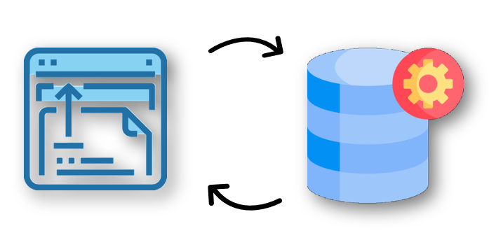
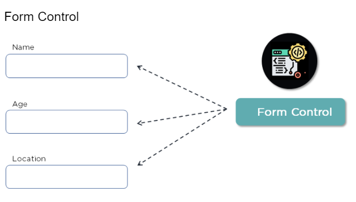
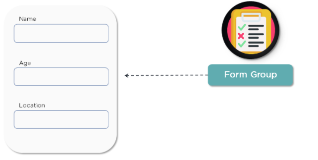

# Angular Interview Questions

If you are well versed in the Angular Framework, then these Frontend Developer Interview Questions on Angular will be helpful.

## What is Data Binding and how does it work? Which Data Binding methods does Angular use?

Data binding is a method of manipulating web page elements through the usage of a web browser. It's utilized in interactive elements like forms, calculators, tutorials, and games on web pages.

Two-way Data Binding is used by Angular. Any modifications made to the user interface mirror the elements in the model state and vice versa.

## What is Typescript?

TypeScript is an object-oriented programming language that is a superset of JavaScript. Simply put, it's JavaScript with a slew of other remarkable capabilities. All TypeScript code is eventually compiled to JavaScript.

- TypeScript supports all JavaScript libraries and frameworks, to name a few essential characteristics. Angular is a single-page application framework written in JavaScript.
- With the rise in code complexity, JavaScript needed to meet OOP's criteria, which led to the creation of TypeScript.
- TypeScript aids in the production of faster code, which improves performance.

## What is AoT Compilation? How is it different from JiT?

Ahead of Time (AOT), compilation translates your code as it is being built, rather than when it is downloaded and run by the browser. This guarantees that the browser renders content quickly. Include the —aot option with the ng build or ng serve commands to specify AOT compilation.

The Just-in-Time (JIT) compilation technique converts computer code to machine code while it is being executed or run. Dynamic compilation is another name for it. When you use the ng build or ng serve CLI commands, by default it uses JIT compilation.

## What are Pipes in Angular? Explain its types

Pipes are simple functions that accept an input value, process it, and return an altered value as an output, in a more technical sense. Angular has several built-in pipes. You can, however, make custom pipes to meet your specific requirements.

The following are some major features:

- The pipe "|" symbol is used to define pipes.
- Pipes can be linked together in a chain.
- The colon (:) sign can be used to provide arguments to pipes.

### Pure Pipes

These are pipes with just pure functions. As a result, a pure pipe uses no internal state, and the output remains constant as long as the parameters provided remain constant. When Angular detects a change in the arguments being given, it invokes the pipe. Throughout all components, a single instance of the pure pipe is used.

### Impure Pipes

Angular calls an impure pipe for every change detection cycle, independent of the change in the input fields. For these pipes, it produces multiple pipe instances. The inputs to these pipes can be changed.

All pipes are pure by default. On the other hand, the pure attribute can be used to identify impure pipes, as demonstrated below.

@Pipe({

name: 'demopipe',

pure : true/false

})

export class DemopipePipe implements PipeTransform {

## In Angular, what are Promises and Observables?

While both concepts in Angular deal with asynchronous events, Promises deal with one at a time, whereas observables deal with a sequence of events over time.

- Promises are objects that emit only one value at a time. They go into effect right once they're created and can't be stopped. They are Promises to the child Push Errors.
- Observables - Observables are only executed when the subscribe() method is used to subscribe to them. Over a period, they emit multiple values. They aid in the execution of tasks such as forEach, filter, and retry, among others. Subscribers receive errors as a result of their actions. The listener stops receiving new data when they perform the unsubscribe() method.

## What are Form Control and Form Groups?

### Form Control

- It enables validation through the Form Control class.
- It produces a new instance of this class for each input field.
- These instances allow you to verify the field's values to see if they've been touched, untouched, or dirty.

### Form Group

- A group of controls is represented by the FormGroup class.
- Multiple control groups are possible in a form.
- If all the controls are valid, the Form Group class returns True.
- It also includes a list of all validation problems.

## What is Eager and Lazy Loading?

Eager loading - The default module-loading approach is eager loading. Eager loading feature modules are loaded before the program starts. You usually reserve this for applications that aren't too large.

Lazy Loading - When there is a demand, lazy loading dynamically loads the feature modules. This speeds up the application. It's utilized in larger applications where all the modules aren't required right at the start.

## In Angular, what is String Interpolation?

String interpolation is a one-way data-binding method that delivers data from TypeScript code to an HTML view. Double curly braces are used to indicate it. This template expression allows the data from the component to be displayed in the view.

{{ data }}
