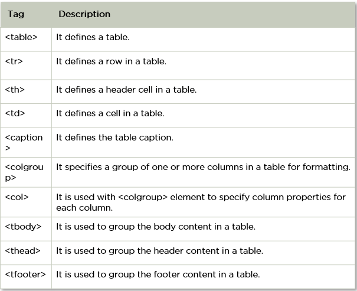
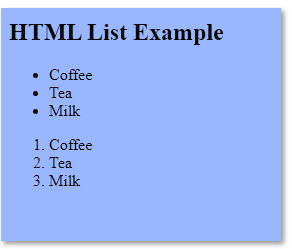

# Soft HTML Interview Questions

HTML is an integral part of Frontend Development. The following set of Frontend Developer Interview Questions are based on HTML.

## What Is an Attribute in HTML?

<h1>Hello</h1>

Welcome

 

<h2>Click on the button to subscribe</h2>

<button>Subscribe</button>

- Attributes are the properties that can be added to an HTML tag that change the way the tag behaves or is displayed.
- It adds attributes right after the name of the HTML tag, inside the brackets.

## What is Marquee in HTML?

- The marquee is used to scroll the text on the webpage.
- It automatically scrolls the image or text up, down, left, or right.
- You must use <marquee>marquee</marquee> to tags to apply for a marquee.

## What is Semantic HTML? and how does it work?

- Semantic HTML is a type of coding.
- It is the use of HTML markup to emphasize the content's semantics or meaning.
- Consider the following scenario: The <b></b> tag is not used for bold statements in semantic HTML, while the <i></i> element is used for italic.
- Instead, you use the <em></em> and <strong></strong> tags.

## How do you Display a Table on an HTML Webpage?

- To display data in a tabular format, use the HTML table> tag.
- It's also utilized to control the page's layout, such as the header section, navigation bar, body content, and footer section.

## What is SVG in HTML?

<svg width="100" height="100">

      <circle cx="50" cy="50" r="40" stroke="yellow" stroke-width="4" fill="red" />

</svg>

- HTML SVG is a markup language that describes vector and raster graphics. XML text files define SVG pictures and associated behaviors.
- It's typically used for X, Y coordinate system diagrams like pie charts and 2-Dimensional graphs.

## In HTML, how do you separate a section of text?

In HTML, you use the following tags to divide a chunk of text:

  br tag–It's a character that's used to break up a line of text. It transfers the text flow to a new line by breaking the existing line.

p
 tag–This tag is used to create a text paragraph.

<blockquote>blockquote</blockquote> This tag is used to indicate big quoted passages.

## How do you Create Nested Web Pages in HTML?

<!DOCTYPE html>

    <html>

      <body>

        <h2>HTML Iframes example</h2>

        

          specify the size of the iframe using the height and width attributes:

        

        <iframe src="https://simplilearn.com/" height="600" width="800"></iframe>

      </body>

    </html>

- You refer a webpage within a webpage to as a nested web page.
- Using HTML's built-in iframe tag, you can create nested web pages.

## Differentiate Between Ordered List and Unordered List

<!DOCTYPE html>

    <html>

      <body>

        <h2>HTML List Example</h2>

        <ul>

          <li>Coffee</li>

          <li>Tea</li>

          <li>Milk</li>

        </ul>

        <ol>

          <li>Coffee</li>

          <li>Tea</li>

          <li>Milk</li>

        </ol>

      </body>

    </html>

- An unordered list uses <ul> ul </ul> tags and each element of the list is written between <li> li </li> tags.
- An ordered list uses <ol>ol</ol> tags and each element of the list is written between <li> li </li> tags.

Now that we are familiar with HTML questions, let’s look at the next set of Frontend Developer Interview Questions, CSS.
