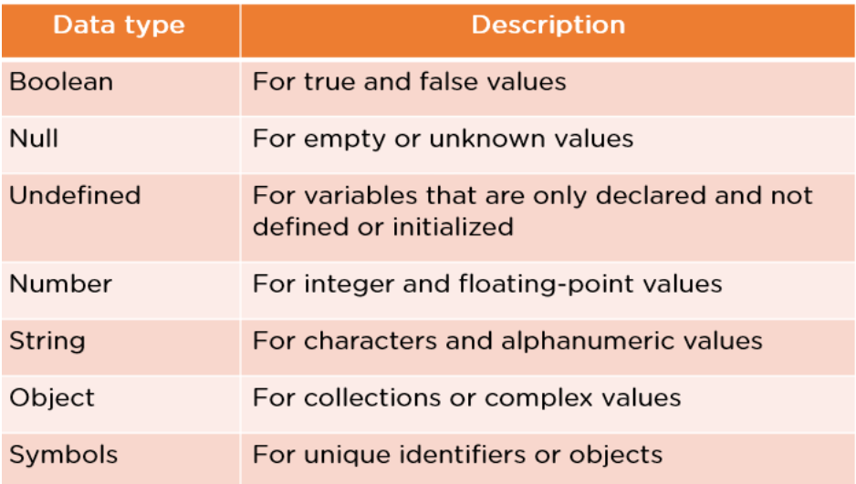
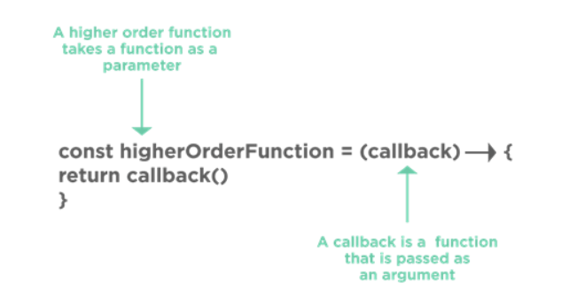

# Soft JavaScript Interview Questions

JavaScript is used to add user interaction to an application. The following section targets the commonly asked JavaScript Frontend Developer Interview Questions.

## What are the various Data Types in JavaScript?

JavaScript has many data types to provide the basic functionality needed for a web application. They are mentioned in this table.

## What is Callback in JavaScript?

