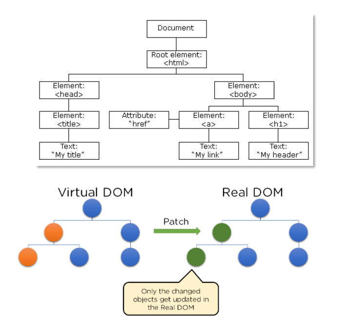
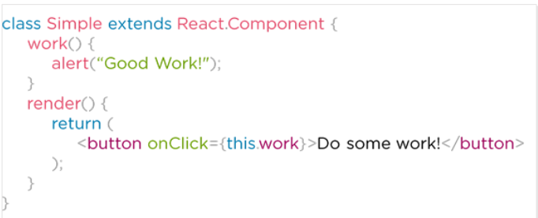
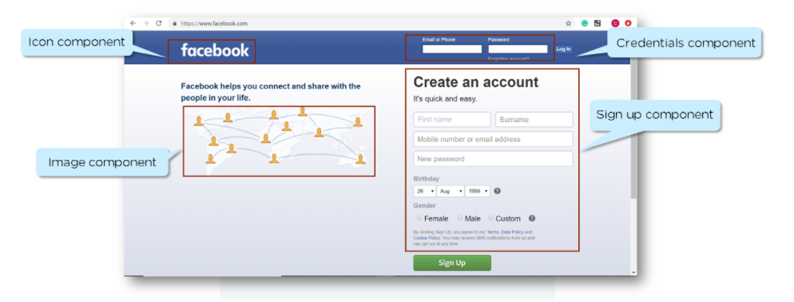
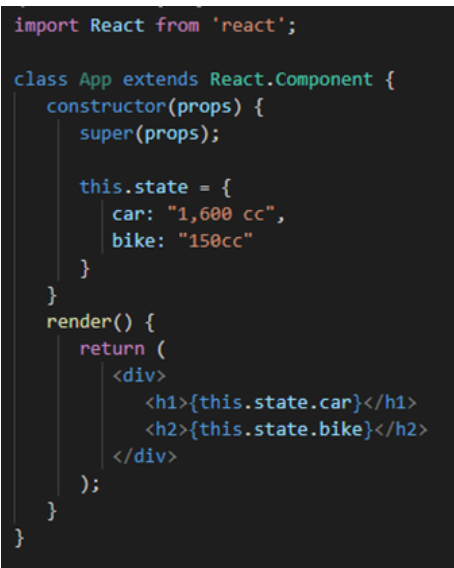
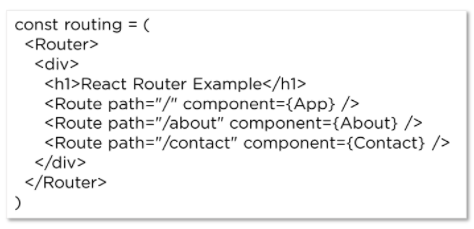

# Soft ReactJS Interview Questions

React is a popular Frontend JavaScript library. It is vital to have a good understanding of a JavaScript framework or library for app development.

The following segment of Frontend Developer Interview Questions comprises React questions.

## What is JSX?

- JSX is a JavaScript syntactic extension. It's a term used in React to describe how the user interface should seem.
- You can write HTML structures in the same file as JavaScript code by utilizing JSX.
- Because it avoids the use of complicated JS DOM structures, JSX makes the code easier to comprehend and debug.

## What is Virtual DOM?

- The Virtual DOM is the lightweight version of the Real DOM that React retains in memory.
- Because nothing is drawn on the screen when processing Real DOM, it is substantially slower than handling virtual DOM.
- When an object's state changes, Virtual DOM updates only that object in the real DOM rather than all of them.

## What are React Extensions? Name a few of them.

- React is more than just a UI framework; it contains a slew of extensions that cover the entire application architecture.
- It has a server-side rendering feature.
- Supports the creation of mobile apps.
- Flux and Redux, among other things, have been added to the mix.
  
- Flux is Facebook's application architecture for developing online applications.
- React Native allows you to create mobile apps entirely in JavaScript.

## What is an Event in React? How do you create one?

An event is an action triggered by the user or any system event, like pressing a key, a mouse key, etc.

## What are Components in ReactJS?

Components are the building blocks of a React application that represent a part of the user interface.

- A component used in one area of the application can be reused in another area. This helps speed up the development process.
- A component can contain several other components.
- A component must define a render method that specifies how the component renders to the DOM in its minimal form.
- A component can also receive props. These are properties passed by its parent to specify values.

## What is a State in React? How do you implement it?

A state is an object that stores the values of properties belonging to a component that could change over a period of time.

Here are a few features of a State -

- You can change a state as a result of a user's action or changes in the network.
- React re-renders the component to the browser whenever the state of an object changes.
- You initialize the state object in the constructor.
- It can store multiple properties in the state object.
- this.setState() is used to alter the state object's value.
- The setState() function merges the new and old state and the previous state in a shallow merge.

## What is a Higher Order and Pure Components in React?

### Higher Order Components

- A higher-order component is a function that takes a component and returns a new component.
- It facilitates reusing of component logic.

const NewComponent = higherOrderComponent(originalComponent)

### Pure Components

- React.Component is the base class for React components. React.PureComponent is a variation of React.Component class and does a shallow comparison of props and state.
- A React component can be considered pure if it renders the same output for the same state and props.

## How do you Implement React Routing?

Considering that you have the App, About, and Contact components, routing can be implemented using the code shown above.
